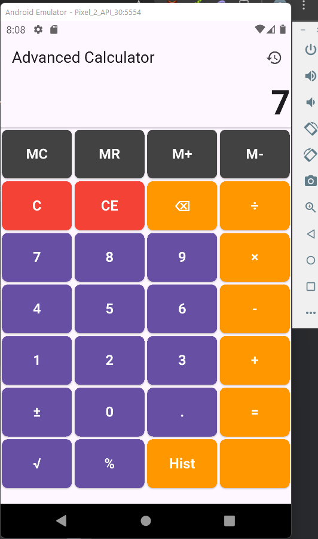

# compile_calculator
# Advanced Flutter Calculator




A comprehensive calculator application built with Flutter that demonstrates advanced Dart concepts and state management. This app features basic and advanced mathematical operations, memory functions, and calculation history tracking.

## Features

- **Basic Operations**: Addition, Subtraction, Multiplication, Division
- **Advanced Functions**: Square root, Percentage, Sign toggle
- **Memory Operations**: MC, MR, M+, M-
- **History Tracking**: View last 5 calculations
- **Error Handling**: Division by zero, invalid operations
- **Responsive UI**: Adapts to different screen sizes
- **Visual Feedback**: Clear button states and operation indicators
- **Professional Design**: Clean interface with intuitive layout

## Technical Highlights

- State management using `StatefulWidget`
- Proper separation of business logic and UI
- Comprehensive error handling
- Display formatting for different number lengths
- History tracking with toggle functionality
- Memory operations implementation
- Responsive button layout

## Installation

1. Ensure you have Flutter installed (version 3.0.0 or higher)
2. Clone this repository:
   ```bash
   git clone https://github.com/LordRalph123/compile_calculator.git
